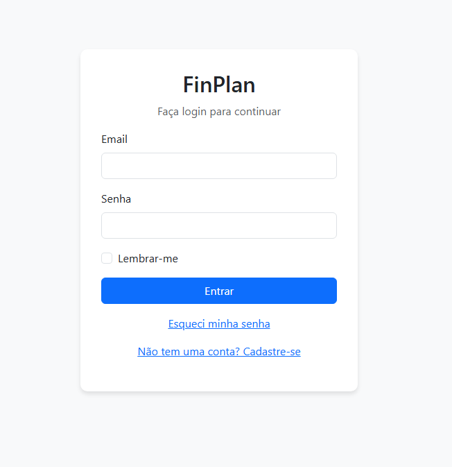

# 💰 FinPlan — Plataforma de Gestão Financeira

**FinPlan** é uma aplicação web desenvolvida em **Python (Flask)** para **controle e análise financeira pessoal**, permitindo o gerenciamento de receitas, despesas e categorias, com **gráficos interativos**, **autenticação de usuários** e **insights automáticos baseados em tendências**.



---

## 🚀 Funcionalidades Principais

- 📊 **Dashboard financeiro** com resumo e gráficos dinâmicos  
- 💵 **Cadastro e histórico de transações** (receitas e despesas)  
- 🏷️ **Gestão de categorias personalizadas**  
- 📅 **Análise mensal e previsão de tendências**  
- 🧠 **Recomendações automáticas baseadas em IA**  
- 👤 **Sistema de login e cadastro com autenticação segura**  
- 📈 **Visualização de progresso financeiro e saldo total**

---

## 🧠 Objetivo do Projeto

O FinPlan foi criado para ajudar usuários a **controlar e entender sua vida financeira** de forma intuitiva e acessível.  
O projeto também serviu como um estudo prático de desenvolvimento **full-stack com Flask**, unindo backend, banco de dados e uma interface moderna.

> “A ideia principal é simplificar o controle financeiro e transformar dados em decisões inteligentes.”

---

## 🧩 Tecnologias Utilizadas

**Backend**
- Python 3.10+
- Flask
- Flask-Login
- SQLAlchemy
- SQLite

**Frontend**
- HTML5, CSS3, JavaScript
- Tailwind CSS
- ApexCharts.js

**Outros**
- Jinja2 (templating)
- dotenv (gerenciamento de variáveis de ambiente)
- Werkzeug (segurança e hash de senhas)

---

## ⚙️ Instalação e Execução

### 1️⃣ Clonar o repositório
```bash
git clone https://github.com/Gabriel-Ctrll/ProjetoFinPlan.git
cd ProjetoFinPlan
2️⃣ Criar ambiente virtual
bash
Copiar código
python -m venv venv
source venv/bin/activate  # Linux/Mac
venv\Scripts\activate     # Windows
3️⃣ Instalar dependências
bash
Copiar código
pip install -r requirements.txt
4️⃣ Rodar o servidor Flask
bash
Copiar código
flask run
Acesse no navegador:
👉 http://localhost:5000

🖼️ Capturas de Tela
Tela de login de usuário

Tela de cadastro


Cadastro e histórico de transações


Gestão de categorias de receitas e despesas


Painel financeiro com gráficos e resumo

Tendências e recomendações automáticas


(As imagens acima representam as telas reais do sistema.)

🔒 Segurança
Autenticação segura via Flask-Login

Senhas criptografadas com hash SHA-256

Proteção contra injeção SQL via SQLAlchemy ORM

Sessões autenticadas e seguras

📁 Estrutura do Projeto
bash
Copiar código
ProjetoFinPlan/
│
├── app/
│   ├── __init__.py
│   ├── models.py
│   ├── routes.py
│   ├── templates/
│   └── static/
│
├── instance/
│   └── database.db
│
├── .env.example
├── requirements.txt
├── README.md
└── run.py
🧭 Roadmap (Melhorias Futuras)
📤 Exportar relatórios em PDF ou Excel

📱 Interface 100% responsiva e mobile-friendly

🌐 Deploy completo com banco remoto (Render ou Railway)

📊 Dashboard com filtros por período e comparativos

🤖 Recomendador financeiro com IA aprimorada

👨‍💻 Autores
Nome	Função	GitHub
Israel Ueda Massatoshi	Backend & Frontend Developer	@IsraelUeda
Gabriel Araújo da Silva	Full-Stack Developer	@Gabriel-Ctrll

🪪 Licença
Este projeto é licenciado sob a MIT License.

🌐 Demonstração (opcional)
(Quando o deploy estiver ativo)
🔗 Acesse a versão online do FinPlan

💡 Aprendizados
Durante o desenvolvimento, foram explorados conceitos como:

Estrutura modular de aplicações Flask

Boas práticas de rotas, templates e banco de dados

Integração de bibliotecas JavaScript para visualização de dados

Design limpo e moderno com Tailwind CSS

Autenticação, segurança e controle de sessão

✨ Contribuição
Faça um fork do repositório

Crie uma branch (git checkout -b minha-feature)

Faça commit das mudanças (git commit -m 'Adiciona nova feature')

Envie o push (git push origin minha-feature)

Abra um Pull Request

📌 FinPlan — Uma plataforma moderna para controle financeiro pessoal, com design limpo, código organizado e potencial para expansão com recursos de análise inteligente.
